# Felix [中文](README_zh.md)
[](https://travis-ci.org/libragen/felix)
[](https://goreportcard.com/report/github.com/libragen/felix)
## Thanks to [360 Total Security](http://www.360totalsecurity.com/) and [360-web-platform ](https://github.com/Qihoo360)
## For Whom

- BackEnd Engineer
- Golang SQL RESTful APIs engineer
- DevOps Engineer
- People Heavily engage with SSH

## Do What
- [a slim jump SSH server with Web UI](https://github.com/libragen/felix/tree/master/ssh2ws)
- manage massive SSH login configuration
- ssh login speedily
- generate a RESTful app from SQL database with [gin-gonic/gin](https://github.com/gin-gonic/gin) and [GORM](https://github.com/jinzhu/gorm) in GO
- start TCP and SOCK proxy with ssh speedily
- terminal todo task list
- Pewdiepie's brofit command to subscribe the Youtube channel

## Demo `config.toml` file 

```toml
[spiderhn]
    cookie="user=neoxhau&SlKqTK32QSFSiWQu1vGgCr4aqvTx5NxT" #some cookie for hacknews spider
    userAgent="Mozilla/5.0 (Windows NT 10.0; Win64; x64) AppleWebKit/537.36 (KHTML, like Gecko) Chrome/74.0.3729.157 Safari/537.36"
    youdaoAppKey="xxx" # youdao tranlate app key
    youdaoAppHost="http://openapi.youdao.com/api"
    youdaoAppSecret="xx" # youdao tranlate app secret
    
[felix]
    slack="https://home.mojotv.cn/api/wslog/hook-api?_t=kiz9Wf-O6_lbY2pz2lGEeA" 
[sshw]
    addr=":2222"
    user="xxx" # init user
    password="xxx" # init password
    secret="9cAmRT3y&s6n$*3Lx*LaWZIi9I7yoNSK" # jwt secret 32 byte
    expire= 24 #jwt expire hours
[tech_mojotv_cn]
    srcDir="D:\\code\\tech.mojotv.cn" # my jekyll blog
[libragen_cn]
    srcDir="D:\\code\\libragen.cn" # my jekyll blog about libragen
```

## Demo Nginx Config file 
```ini
server {
        server_name home.mojotv.cn;
        charset utf-8;

        location /ws/
        {
                 proxy_pass http://127.0.0.1:2222;
                 proxy_http_version 1.1;
                 proxy_set_header Upgrade $http_upgrade;
                 proxy_set_header Connection "Upgrade";
                proxy_set_header X-Real-IP $remote_addr;
         }
        location / {
           proxy_set_header X-Forwarded-For $remote_addr;
           proxy_set_header Host $http_host;
           proxy_pass http://127.0.0.1:2222;
        }
        access_log  /data/wwwlogs/home.mojotv.cn.log;

    listen 443 ssl; # managed by Certbot
    ssl_certificate /etc/letsencrypt/live/captcha.mojotv.cn/fullchain.pem; # managed by Certbot
    ssl_certificate_key /etc/letsencrypt/live/captcha.mojotv.cn/privkey.pem; # managed by Certbot
    include /etc/letsencrypt/options-ssl-nginx.conf; # managed by Certbot
    ssl_dhparam /etc/letsencrypt/ssl-dhparams.pem; # managed by Certbot

}
server {
    if ($host = home.mojotv.cn) {
        return 301 https://$host$request_uri;
    } # managed by Certbot


        listen 80;
        server_name home.mojotv.cn;
    return 404; # managed by Certbot


}
        
```

## Overview
commands:

```bash
$ felix -h
Usage:
  felix [flags]
  felix [command]

Available Commands:
  brofist     Pewdiepie needs your help.Do your part to subscribe Pewdiepie's Youtube Channel.
  clean       purge all felix configuration
  ginbin      Ginbin allows you to embed a directory of static files into your Go binary to be later served from github.com/gin-goin/gin
  ginbro      generate a RESTful codebase from SQL database
  godoc       golang.google.cn/pkg
  help        Help about any command
  json        open a tab in browser to convert json to golang struct
  scpd        scp download file or folder
  scpu        scp upload a file or a folder
  ssh         open a ssh terminal
  sshad       add a ssh connection configuration
  sshdu       duplicate a ssh connection
  sshedit     update a ssh connection
  sshexport   export all ssh connection configuration to a csv file
  sshimport   import massive ssh connection configuration from a csv file
  sshinfo     view a ssh connection
  sshls       list all ssh connection configuration or search by hostname
  sshproxy    ssh port proxy
  sshrm       delete a ssh connection
  sshsocks    start a socks4/5 proxy
  sshw        open a web UI for Felix http://localhost:2222
  task        list all rows in TaskList
  taskad      add a row into TaskList
  taskok      set a row done in TaskList
  taskrm      remove a row in TaskList

Flags:
  -h, --help      help for felix
      --verbose   verbose
  -V, --version   show binary build information

Use "felix [command] --help" for more information about a command.

```


## Build and Run

- `go get github.com/libragen/felix`
- `go install`
- [append $GOBIN into your env $PATH](https://stackoverflow.com/questions/25216765/gobin-not-set-cannot-run-go-install)
- `felix -h` 

or just `go build` run binary by `./felix`

## ScreenShot

### command: `felix sshw`
```bash
$ felix sshw -h
the demo website is http://home.mojotv.cn:2222

Usage:
  felix sshw [flags]

Flags:
  -a, --addr string       listening addr (default ":2222")
  -x, --expire uint       token expire in * minute (default 1440)
  -h, --help              help for sshw
  -p, --password string   auth password (default "admin")
  -s, --secret string     jwt secret string
  -u, --user string       auth user (default "admin")

Global Flags:
      --verbose   verbose
```

```bash
$ felix sshw
use random string as jwt secret: @Ubr)Vrp~Zoo6Rvrk1PP1*ZXPYby_Z)s
login user: admin
login password: admin
login expire in 1440 minutes
[GIN-debug] [WARNING] Now Gin requires Go 1.6 or later and Go 1.7 will be required soon.

[GIN-debug] [WARNING] Creating an Engine instance with the Logger and Recovery middleware already attached.

[GIN-debug] [WARNING] Running in "debug" mode. Switch to "_release" mode in production.
 - using env:   export GIN_MODE=release
 - using code:  gin.SetMode(gin.ReleaseMode)

[GIN-debug] POST   /api/login                --> github.com/libragen/felix/ssh2ws/controllers.GetLoginHandler.func1 (4 handlers)
[GIN-debug] GET    /api/ws/:id               --> github.com/libragen/felix/ssh2ws/controllers.WsSsh (5 handlers)
[GIN-debug] GET    /api/ssh                  --> github.com/libragen/felix/ssh2ws/controllers.SshAll (5 handlers)
[GIN-debug] POST   /api/ssh                  --> github.com/libragen/felix/ssh2ws/controllers.SshCreate (5 handlers)
[GIN-debug] GET    /api/ssh/:id              --> github.com/libragen/felix/ssh2ws/controllers.SshOne (5 handlers)
[GIN-debug] PATCH  /api/ssh/:id              --> github.com/libragen/felix/ssh2ws/controllers.SshUpdate (5 handlers)
[GIN-debug] DELETE /api/ssh/:id              --> github.com/libragen/felix/ssh2ws/controllers.SshDelete (5 handlers)
[GIN-debug] GET    /api/sftp/:id             --> github.com/libragen/felix/ssh2ws/controllers.SftpLs (5 handlers)
[GIN-debug] GET    /api/sftp/:id/dl          --> github.com/libragen/felix/ssh2ws/controllers.SftpDl (5 handlers)
[GIN-debug] GET    /api/sftp/:id/cat         --> github.com/libragen/felix/ssh2ws/controllers.SftpCat (5 handlers)
[GIN-debug] GET    /api/sftp/:id/rm          --> github.com/libragen/felix/ssh2ws/controllers.SftpRm (5 handlers)
[GIN-debug] GET    /api/sftp/:id/rename      --> github.com/libragen/felix/ssh2ws/controllers.SftpRename (5 handlers)
[GIN-debug] GET    /api/sftp/:id/mkdir       --> github.com/libragen/felix/ssh2ws/controllers.SftpMkdir (5 handlers)
[GIN-debug] POST   /api/sftp/:id/up          --> github.com/libragen/felix/ssh2ws/controllers.SftpUp (5 handlers)
[GIN-debug] Listening and serving HTTP on :2222

```
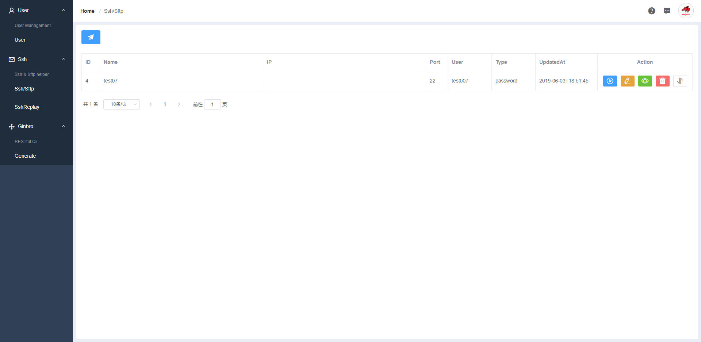

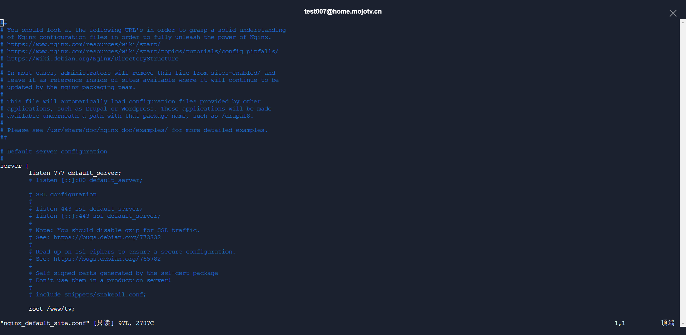

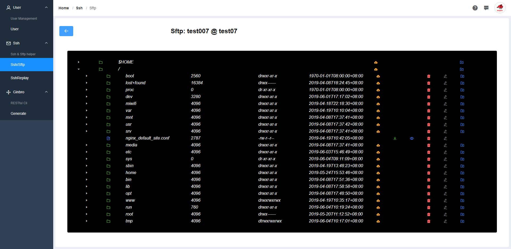

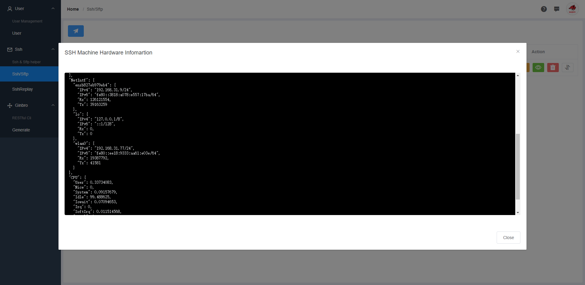

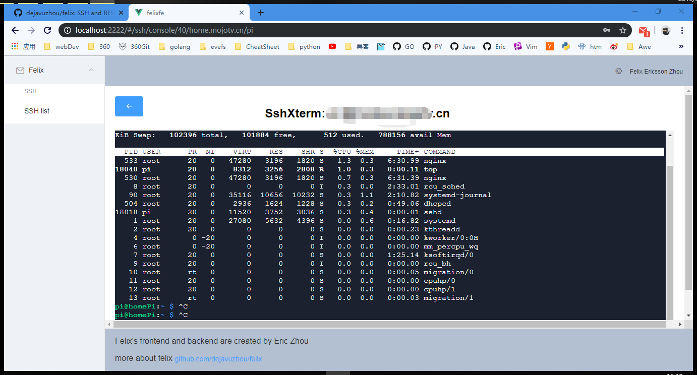

### command: `felix ginbro`  [ginbro doc](ginbro)

`felix ginbro` command is migrated from [libragen/ginbro](https://github.com/libragen/ginbro).
[Generated WordPress MySQL database running demo](http://ginbro.mojotv.cn/swagger/)

[Generated code base](https://github.com/libragen/ginbro-son)

```bash
$ felix ginbro
Error: required flag(s) "appDir", "dbAddr" not set
Usage:
  felix ginbro [flags]

Examples:
felix rest -u root -p password -a "127.0.0.1:3306" -d dbname -c utf8 --authTable=users --authColumn=pw_column -o=FelixRestOut"

Flags:
  -o, --appDir string       app's code output directory
  -l, --appListen string    app's listening addr (default "127.0.0.1:5555")
      --authColumn string   bcrypt password column (default "password")
      --authTable string    login user table (default "users")
  -a, --dbAddr string       database connection addr (default "127.0.0.1:3306")
  -c, --dbCharset string    database charset (default "utf8")
  -n, --dbName string       database name
  -p, --dbPassword string   database user password (default "password")
  -t, --dbType string       database type: mysql/postgres/mssql/sqlite (default "mysql")
  -u, --dbUser string       database username (default "root")
  -h, --help                help for ginbro

Global Flags:
      --verbose   verbose

required flag(s) "appDir", "dbAddr" not set
```
#### the output code base
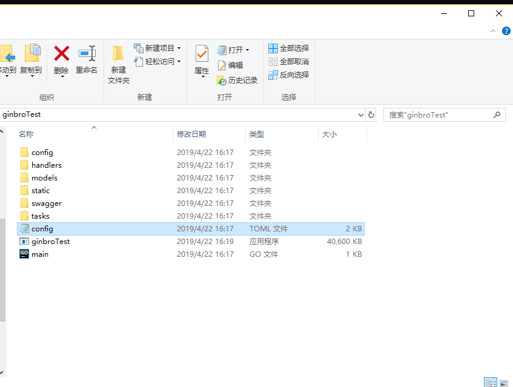

### command: `felix sshls`

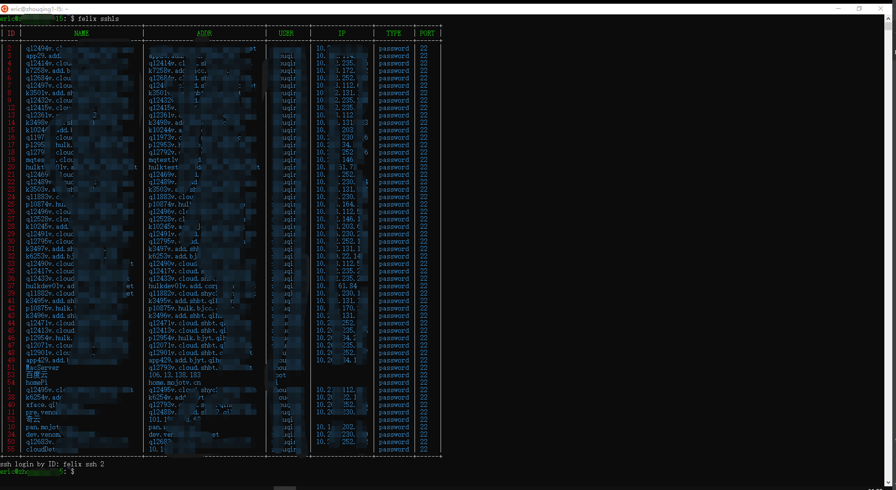

### command: `felix ssh 3`

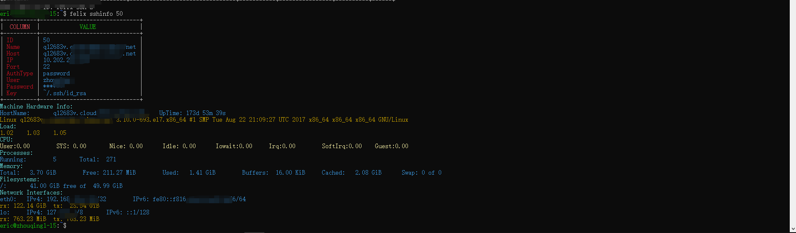

### command: `felix ssh 2`

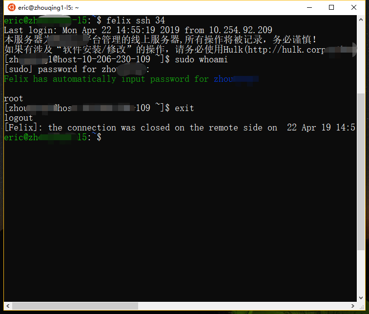

### command: `felix sshsocks 34 -l 1080`

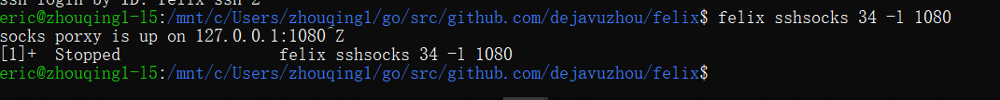

### command: `felix taskad`

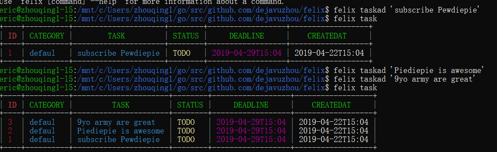


## Code Logic

- save SSH configurations into a SQLite.db in `$HOME/.felix.db`
- use [spf13/cobra](https://github.com/spf13/cobra#getting-started) as command framework

### `felix ginbro` Logic
1. use SQL query get all tables and column schema from database
2. transform SQL type into Golang type and [Swagger Doc](https://swagger.io/) type
3. use [Golang Std Lib(text/template)](https://golang.org/pkg/text/template/) to output [Gin's handler and Route files](https://github.com/gin-gonic/gin) and [GORM model files](https://github.com/jinzhu/gorm)
4. `os.exec` call `go fmt` to format the output codebase

### `felix sshls` Logic
1. use [GORM](https://github.com/jinzhu/gorm) retrieve all SSH configuration from SQLite.db
2. use [olekukonko/tablewriter](https://github.com/olekukonko/tablewriter) write table into terminal

### `felix ssh 9` Logic
1. get a ssh configuration by ID
2. use [golang.org/x/crypto/ssh](https://golang.org/x/crypto/ssh) package start ssh session
3. customize `stdin` and `stdout` to listen Sudo command for password message then input sudo password automatically