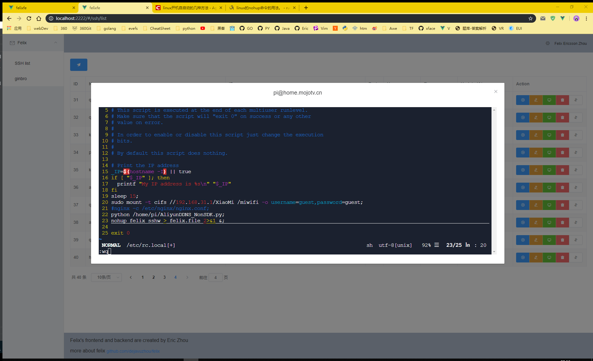
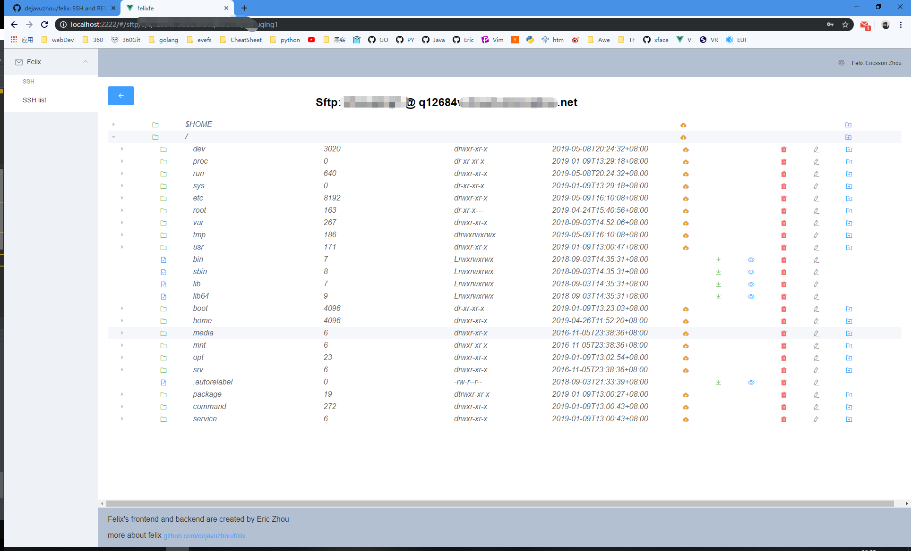
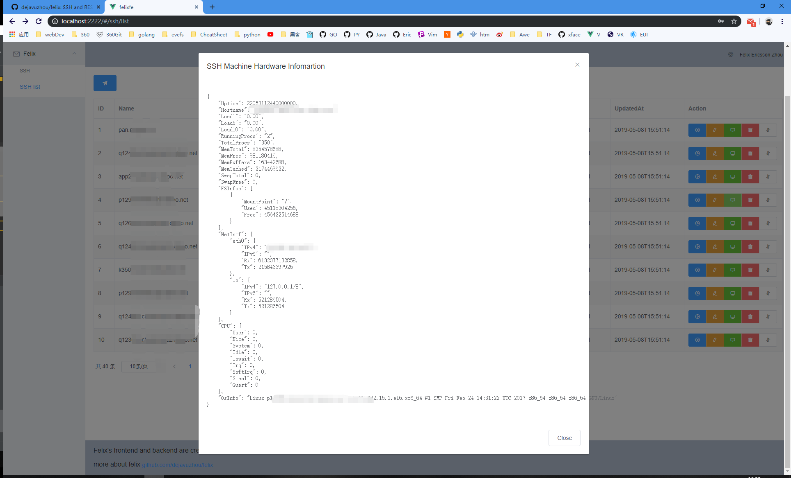

# Felix
[](https://travis-ci.org/libragen/felix)

## 给谁用?

- 后端工程师
- Golang RESTful APIs with SQL 工程师
- 运维(开发工程师)
- 工作中频繁使用SSH和不停的输入sudo命令的工程师

## 能做什么?

- 管理大量SSH连接配置
- 快速的使用SSH登陆功能和再应用层免去输入sudo密码
- 快速的根据SQL数据库表结构生成RESTfual Golang APIs 代码 [gin-gonic/gin](https://github.com/gin-gonic/gin) and [GORM](https://github.com/jinzhu/gorm) in GO
- 利用SSH快速的开启TCP和SOCKS5/4 代理
- 建议的命令行TODO-LIST
- Pewdiepie's brofit command to subscribe the Youtube channel


## Demo `config.toml` file 

```toml
[spiderhn]
    cookie="user=neoxhau&SlKqTK32QSFSiWQu1vGgCr4aqvTx5NxT" #some cookie for hacknews spider
    userAgent="Mozilla/5.0 (Windows NT 10.0; Win64; x64) AppleWebKit/537.36 (KHTML, like Gecko) Chrome/74.0.3729.157 Safari/537.36"
    youdaoAppKey="xxx" # youdao tranlate app key
    youdaoAppHost="http://openapi.youdao.com/api"
    youdaoAppSecret="xx" # youdao tranlate app secret
    
[felix]
    slack="https://felix.mojotv.cn/api/wslog/hook-api?_t=kiz9Wf-O6_lbY2pz2lGEeA" 
[sshw]
    addr=":2222"
    user="xxx" # init user
    password="xxx" # init password
    secret="9cAmRT3y&s6n$*3Lx*LaWZIi9I7yoNSK" # jwt secret 32 byte
    expire= 24 #jwt expire hours
[tech_mojotv_cn]
    srcDir="D:\\code\\tech.mojotv.cn" # my jekyll blog
[libragen_cn]
    srcDir="D:\\code\\libragen.cn" # my jekyll blog about libragen
```


## Overview
提供的命令:

```bash
$ felix -h
Usage:
  felix [flags]
  felix [command]

Available Commands:
  brofist     Pewdiepie needs your help.Do your part to subscribe Pewdiepie's Youtube Channel.
  clean       purge all felix configuration
  ginbin      Ginbin allows you to embed a directory of static files into your Go binary to be later served from github.com/gin-goin/gin
  ginbro      generate a RESTful codebase from SQL database
  godoc       golang.google.cn/pkg
  help        Help about any command
  json        open a tab in browser to convert json to golang struct
  scpd        scp download file or folder
  scpu        scp upload a file or a folder
  ssh         open a ssh terminal
  sshad       add a ssh connection configuration
  sshdu       duplicate a ssh connection
  sshedit     update a ssh connection
  sshexport   export all ssh connection configuration to a csv file
  sshimport   import massive ssh connection configuration from a csv file
  sshinfo     view a ssh connection
  sshls       list all ssh connection configuration or search by hostname
  sshproxy    ssh port proxy
  sshrm       delete a ssh connection
  sshsocks    start a socks4/5 proxy
  sshw        open a web UI for Felix http://localhost:2222
  task        list all rows in TaskList
  taskad      add a row into TaskList
  taskok      set a row done in TaskList
  taskrm      remove a row in TaskList

Flags:
  -h, --help      help for felix
      --verbose   verbose
  -V, --version   show binary build information

Use "felix [command] --help" for more information about a command.
```


## 编译和运行

- `go get github.com/libragen/felix`
- `go install`
- [把 $GOBIN 添加到 $PATH](https://stackoverflow.com/questions/25216765/gobin-not-set-cannot-run-go-install)
- `felix -h` 

or just `go build` run binary by `./felix`


## 功能截图


### 命令: `felix sshw`
```bash
$ felix sshw -h
the demo website is http://home.mojotv.cn:2222

Usage:
  felix sshw [flags]

Flags:
  -a, --addr string       listening addr (default ":2222")
  -x, --expire uint       token expire in * minute (default 1440)
  -h, --help              help for sshw
  -p, --password string   auth password (default "admin")
  -s, --secret string     jwt secret string
  -u, --user string       auth user (default "admin")

Global Flags:
      --verbose   verbose
```

```bash
$ felix sshw
use random string as jwt secret: @Ubr)Vrp~Zoo6Rvrk1PP1*ZXPYby_Z)s
login user: admin
login password: admin
login expire in 1440 minutes
[GIN-debug] [WARNING] Now Gin requires Go 1.6 or later and Go 1.7 will be required soon.

[GIN-debug] [WARNING] Creating an Engine instance with the Logger and Recovery middleware already attached.

[GIN-debug] [WARNING] Running in "debug" mode. Switch to "_release" mode in production.
 - using env:   export GIN_MODE=release
 - using code:  gin.SetMode(gin.ReleaseMode)

[GIN-debug] POST   /api/login                --> github.com/libragen/felix/ssh2ws/controllers.GetLoginHandler.func1 (4 handlers)
[GIN-debug] GET    /api/ws/:id               --> github.com/libragen/felix/ssh2ws/controllers.WsSsh (5 handlers)
[GIN-debug] GET    /api/ssh                  --> github.com/libragen/felix/ssh2ws/controllers.SshAll (5 handlers)
[GIN-debug] POST   /api/ssh                  --> github.com/libragen/felix/ssh2ws/controllers.SshCreate (5 handlers)
[GIN-debug] GET    /api/ssh/:id              --> github.com/libragen/felix/ssh2ws/controllers.SshOne (5 handlers)
[GIN-debug] PATCH  /api/ssh/:id              --> github.com/libragen/felix/ssh2ws/controllers.SshUpdate (5 handlers)
[GIN-debug] DELETE /api/ssh/:id              --> github.com/libragen/felix/ssh2ws/controllers.SshDelete (5 handlers)
[GIN-debug] GET    /api/sftp/:id             --> github.com/libragen/felix/ssh2ws/controllers.SftpLs (5 handlers)
[GIN-debug] GET    /api/sftp/:id/dl          --> github.com/libragen/felix/ssh2ws/controllers.SftpDl (5 handlers)
[GIN-debug] GET    /api/sftp/:id/cat         --> github.com/libragen/felix/ssh2ws/controllers.SftpCat (5 handlers)
[GIN-debug] GET    /api/sftp/:id/rm          --> github.com/libragen/felix/ssh2ws/controllers.SftpRm (5 handlers)
[GIN-debug] GET    /api/sftp/:id/rename      --> github.com/libragen/felix/ssh2ws/controllers.SftpRename (5 handlers)
[GIN-debug] GET    /api/sftp/:id/mkdir       --> github.com/libragen/felix/ssh2ws/controllers.SftpMkdir (5 handlers)
[GIN-debug] POST   /api/sftp/:id/up          --> github.com/libragen/felix/ssh2ws/controllers.SftpUp (5 handlers)
[GIN-debug] Listening and serving HTTP on :2222

```








### `felix ginbro` 快速的根据SQL(支持 MySql/SQLite/PostgreSQL)数据库生成

`felix ginbro` command 功能迁移自 [libragen/ginbro](https://github.com/libragen/ginbro).项目
[生成的wordpress项目golang RESTful APIs](http://ginbro.mojotv.cn/swagger/)

[wordpress RESTful Golang Demo代码预览 ](https://github.com/libragen/ginbro-son)

```bash
$ felix ginbro
Error: required flag(s) "appDir", "dbAddr" not set
Usage:
  felix ginbro [flags]
Examples:
felix rest -u root -p password -a "127.0.0.1:3306" -d dbname -c utf8 --authTable=users --authColumn=pw_column -o=FelixRestOut"

Flags:
  -o, --appDir string       app's code output directory
  -l, --appListen string    app's listening addr (default "127.0.0.1:5555")
      --authColumn string   bcrypt password column (default "password")
      --authTable string    login user table (default "users")
  -a, --dbAddr string       database connection addr (default "127.0.0.1:3306")
  -c, --dbCharset string    database charset (default "utf8")
  -n, --dbName string       database name
  -p, --dbPassword string   database user password (default "password")
  -t, --dbType string       database type: mysql/postgres/mssql/sqlite (default "mysql")
  -u, --dbUser string       database username (default "root")
  -h, --help                help for ginbro

Global Flags:
      --verbose   verbose

required flag(s) "appDir", "dbAddr" not set
```
#### the output code base


### command: `felix sshls`


### command: `felix ssh 3`


### command: `felix ssh 2`


### command: `felix sshsocks 34 -l 1080`


### command: `felix taskad`


## 代码架构逻辑

- 保存SSH连接配置信息到SQLite.db in `$HOME/.felix.db`
- 使用 [spf13/cobra](https://github.com/spf13/cobra#getting-started) 作为命令行框架

### `felix ginbro` 架构逻辑
1. 使用SQL命令获取全部表的结构和字段从数据库中
2. 转换 SQL 类型到 [Swagger Doc](https://swagger.io/) 类型和生成每张表的`gorm.Model`的结构体
3. 使用标准库 [Golang Std Lib(text/template)](https://golang.org/pkg/text/template/) 生成 [Gin's handler and Route](https://github.com/gin-gonic/gin) 文件 和 [GORM model](https://github.com/jinzhu/gorm) 文件
4. `os.exec` 执行 `go fmt` 安装golang规范格式化代码仓库

### `felix sshls` Logic
1. 使用 [GORM](https://github.com/jinzhu/gorm) 从SQLite.db获取全部的ssh连接信息
2. 使用 [olekukonko/tablewriter](https://github.com/olekukonko/tablewriter) 输出表格到命令行

### `felix ssh 9` Logic
1. 根据ID从书库中获取一行SSH连接配置
2. 使用 [golang.org/x/crypto/ssh](https://golang.org/x/crypto/ssh)包开启一个ssh session
3. 自定义 `stdin` and `stdout` 监听sudo命令行提示输入密码信息.自动输入sudo密码.